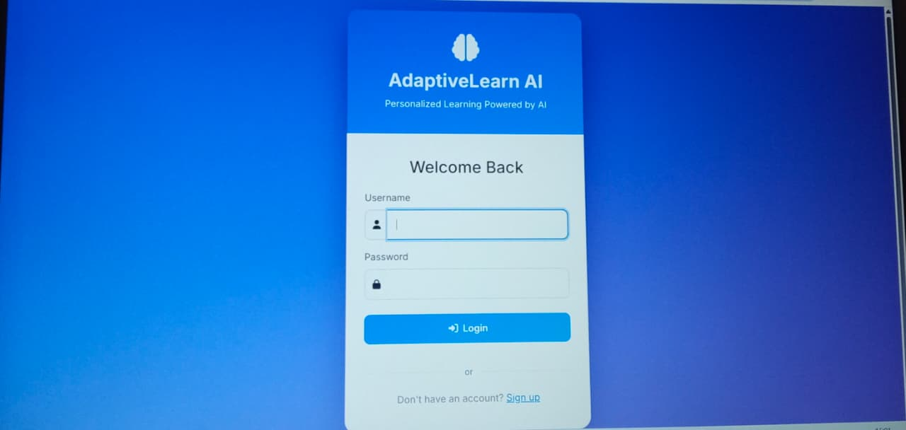
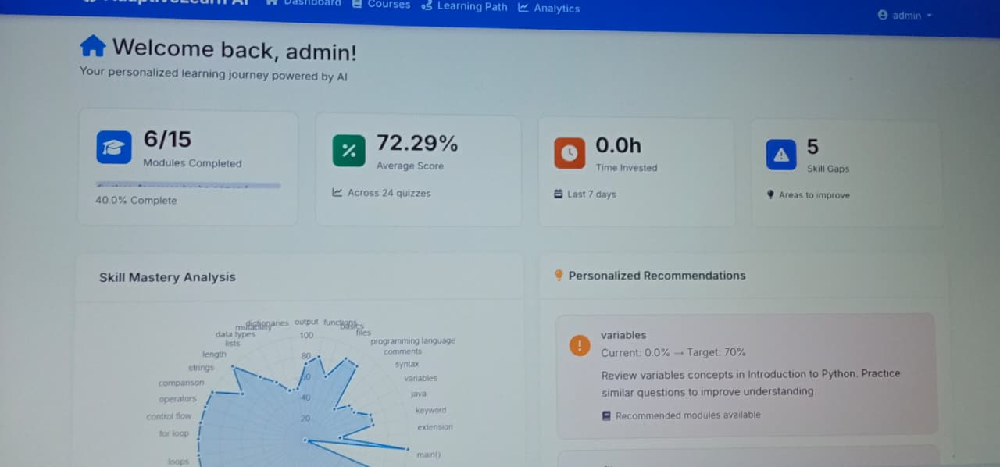
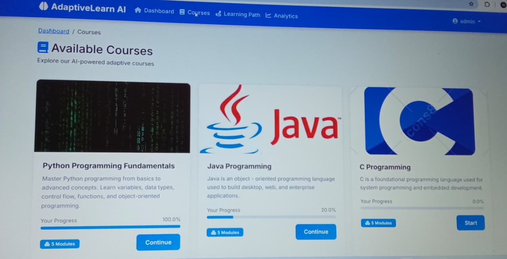
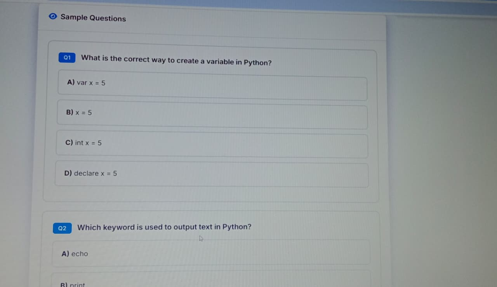
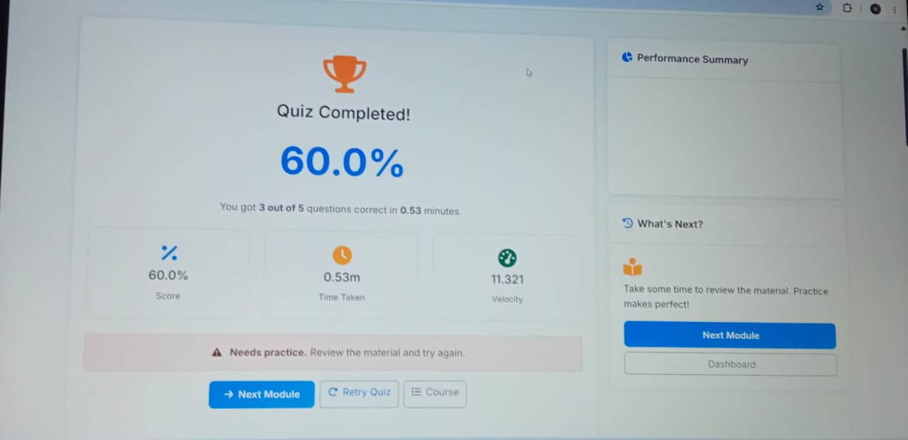
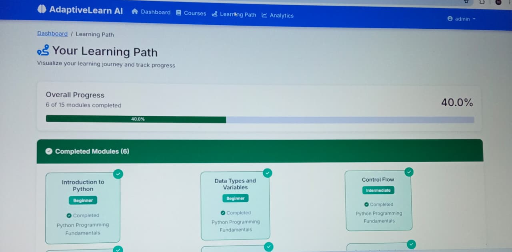

# Adaptive Learning System

## Overview
The Adaptive Learning System is a web application developed using Django to provide personalized online learning. It allows students to access courses, take quizzes, and monitor their learning performance.

## Features
- Student Login
- Course Management
- Online Quiz System
- Performance Analysis
- User-friendly Dashboard

## Technologies Used
- Python
- Django
- HTML
- CSS
- JavaScript
- SQLite

## Project Type
BCA Final Year Major Project

## Author
Nitya Naik

## Project Screenshots

### Login Page

### Dashboard

### Course List

### Quiz Page

### Result Page

### Learning Path

### Analytics

